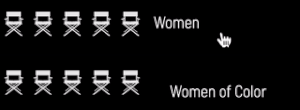

# The Hollywood Diversity Report: Directors

This is my final project for [Critical Data & Visualization](https://github.com/leoneckert/cdv-fall19) at NYU Shanghai.  

## The Story

During the past few years, diversity and representation in media has come to the forefront of cultural conversation. However, much of this conversation has been centered around what we see on the screen and not who has a hand in shaping the art. Representation on the screen is a wonderful thing, but to produce truly relevant and moving cinema, we need filmmakers that relate to and understand the experiences of the diverse characters we see represented.

**Why do I care about this?**

I believe that film as a medium is one of the most immersive and transcendental forms of art. It has the ability to elevate consciousness and bring to light issues that we face in a way that allows us to be both critical and empathetic. I believe that in this multicultural and further globalized world there are a multiplicity of voices that have meaningful experiences that can improve and inform our understanding of the human condition. The inclusion of diverse individuals into the cinematic arts adds nuance and complexity to our ideas of ourselves and the world. In my life, I have found myself and my understanding of the world through this medium and I want to see it grow and continue to inform others as well.

## The Process

My initial idea for this project was to look at diversity over a 10 year period from 2009 to 2019, and include gender, **specific** ethnicity and sexual orientation of each director. 

The decision to limit the number of years within my dataset was mostly due to the scraping process and how difficult it became once the formating of the wikipedia pages I scraped changed. The pages for 2009-2013 were written in the exact same format, while 2014 and above had very different (and troublesome) formatting per page. 

To take a look at the pages I scraped, replace {} with the year you are interested in and follow this link "https://en.wikipedia.org/wiki/List_of_American_films_of_{ **YEAR**}"

You can also find my python files at [scraping-stuff](https://github.com/saraaahh63/my-cdv-fall19/tree/master/my-work/scraping-stuff). Test.py and data1.json are my attempts at scraping past 2013.

I thought 2013 was an appropriate place to end, because of a report I read published by the Directors Guild of America, where they stated that in 2018 diversity among directors hit a 5 year low and was down 46% from 2013. Based on that, 2013 is an interesting marker for the height of diversity in recent years.

I did not end up including sexual orientation as a category, because it was very hard to verify. A lot of directors on this list are not very famous and information on their personal lives is largely unknown or undiscussed so my percentages would not have been accurate.

I also decided not to look at specific ethnic groups and instead group people together as men of color, women of color and people of color. I did not want this to be about specific groups, but about diversity in general.

In terms of interface, I had wanted to create a grid of movies and watch them disappear from the page as you interact with each category. Originally, I intended to resize the grid after the data points exited so that the remaining points where all next to each other, but I felt that scrolling through so much empty space was a better way to communicate how big the disparity is.

## The Resulting Data

The resulting data was honestly quite shocking. I expected low diversity percentages, but not as low as what it turned out to be. 

Over 2009-2013:
- 81% of films were directed by caucasian men.
- 11% of films were directed by men of color.
- 7% of films were directed by caucasian women.
- 1% of films were directed by women of color.

## Final Thoughts and Future Progress

I am very glad I chose to go with this topic, it is something that I care about a lot and I am glad to know the actual numbers, but I do wish I was able to scrape 2014 to 2019. I think that I might continue to work on this and expand my dataset.

I think if I could find accurate data or reach out to each person individually, I would like to include LGBTQ+ identifying as a catgegory and trace diversity in that sense as well.

## Reference Material
- [DGA Report](https://www.dga.org/The-Guild/Diversity/Industry-Reports.aspx)
- [UCLA Hollywood Diversity Report 2019](https://socialsciences.ucla.edu/hollywood-diversity-report-2019/)
